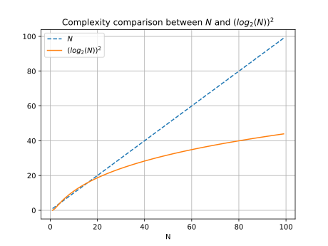

## 算法要点

完全二叉树的特点是除了最后一层之外都是满的。

### 给子节点编号

- 根节点的num(No.)为 1
- 左子节点的num为 `root->num << 1 + 0`
- 右子节点的num为 `root->num << 1 + 1`

这样的编号方法产生的二进制数，恰好是节点在树中的按顺序添加的序号。

比如：
- `root`非空，则`root`为第一个节点
- `root->left`非空，则其num为`10`，对应十进制数是2，该节点为树的第二个节点
- `root->right`非空，则其num为`11`，对应十进制数是3，该节点为树的第三个节点

反过来说，如果给定一个num，可以确定如何通过root查找到子节点：

- 如果为0，则返回`NULL`
- 如果为1，则返回`root`
- 其他情况，转换成二进制数，去掉开头的1，从root开始路由

### 为什么可以使用二分查找

最后一层的子节点都填充上，如果没有子节点，则记为NULL。

能找到最底一层的最后一个非NULL节点，或者找到第一个NULL节点，就可以计算出节点的总数。


转换成另外一题`[1,1,1,1,0,0,0,0]`找到连续1和连续0序列中最后一个1的位置。

### 查找范围

最后一层叶子节点num范围是`[10000..00, 11111...11]`

先确定树最少有几层，可以一直找root的最右子节点。

则上述搜索范围转换成十进制范围可以表示为`[2^n, 2^(n+1)-1]`。

### 算法复杂度

因为二分查找需要O(logN)的复杂度，而根据数字找到子节点也需要O(logN)的算法复杂度，所以该算法的复杂度为`O(logN * logN)`

如果使用迭代的方法，算法复杂度为O(N)，那么`O(N)`和`O(logN*logN)`谁更大呢？或者说需要证明我们的算法复杂度小于`O(N)`

我们先选定一个点1024：

```
N = 1024
logN*logN = 100
```

后者更小，那么随着N的增大，N和logN*logN的增长速度是如何的？求导数：

`N -> 1`

`logN*logN -> (2*logN) / N` 当N=2时为1，之后都将小于1，所以前者的增速更快。

我们也可以通过两者的曲线来比较一下：


